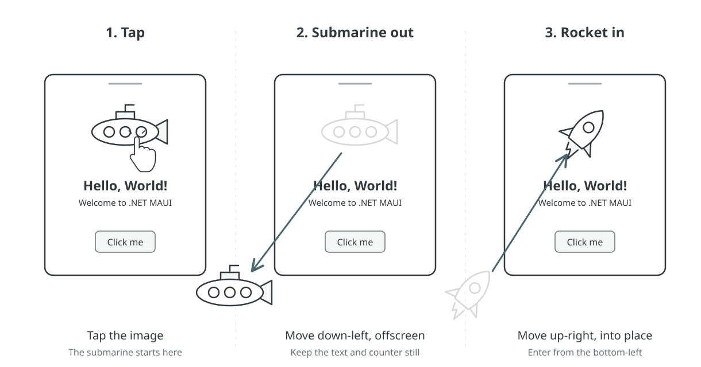

# Sketch to device: a .NET bot launch

Start from the clean XAML template in `demos\MauiXamlDemo`, with its submarine
welcome image and counter. Add the rocket asset and animation during this
walkthrough, then inspect the app on Windows, test it on Android, and record
the interactions.

## Prerequisites

- .NET 11 SDK and the MAUI workload for Windows and Android.
- Android SDK and an installed Android emulator.
- The repository's Sketch to app extension and the Mobile Device plugin.

See the [repository README](../../README.md) for setup and plugin installation.
Paste each prompt into Copilot as a separate message and wait for it to finish.

## 1. Open the sketch board

```text
I need to make some changes to my XAML app.
```

**Expected:** Copilot asks what you want to change. Answer:

```text
Can I sketch it instead?
```

**Expected:** The Sketch to app board opens beside chat.

## 2. Draw the animation

Draw **three frames**, using this wireframe as a reference:



1. **Tap:** the submarine is in its starting position; show a tap on the image.
2. **Submarine out:** show the submarine moving diagonally down-left offscreen.
3. **Rocket in:** show the rocket entering from the bottom-left and moving
   up-right into the original image position.

!In **Notes for Copilot**, write:

```text
The sub is in the project, the rocket is in the .NET 11 template in the dotnet/maui repo.
```

Then send:

```text
Done, please implement.
```

**Expected:** Copilot reads the sketch and notes, adds the rocket asset, and
implements the animation. If it asks for clarification, confirm that tapping
the image should move the submarine out and bring the rocket in.

## 3. Build and run on desktop

```text
Run the XAML app on Windows.
```

**Expected:** Copilot builds the app and opens it on Windows.
The submarine stays still until tapped. A tap moves it down-left
offscreen, then brings the rocket into its place. Tap the rocket to replay.
The welcome text and counter stay in place.

## 4. Inspect the running app

```text
I want to inspect the running app.
```

**Expected:** Copilot opens the MAUI DevFlow Inspector beside chat and connects
it to the running app. Inspect the actual image controls and their parents.
Tap the bot and check the movement, bounds, clipping, and focus state.
After the animation settles, the rocket should be fully visible in the
original position.

**Tip:** If the Inspector does not open, ask: "Open the MAUI DevFlow Inspector
beside chat and show the app's live UI tree."

Use the following prompts only if you observe the corresponding issue.

### If the moving image is clipped

```text
The moving image gets cut off before it reaches the edge of the page.
Can you check why?
```

**Expected:** Copilot uses the Inspector to check the moving image's bounds
and its parents' bounds and clipping settings, and identifies the container
cutting off the movement.

```text
Fix the clipping. Keep the main image still for layout and use a temporary
animation image that can move offscreen outside the clipped container.
When the rocket settles, show the main image with the rocket and remove
the temporary image. Run it again.
```

**Expected:** The image travels offscreen without moving the welcome text or
counter. After settling, the main rocket is fully visible at zero translation
and the temporary animation image is no longer in the live tree.

### If the bot shows a focus border

```text
The bot image gets a border when I tap it. Can you check why?
```

**Expected:** Copilot checks the control type and focus state in the Inspector
and compares them with the native app. An `ImageButton` can show a native focus
outline even when its border width is zero.

If the outline comes from an `ImageButton`, send:

```text
Use an Image with a tap gesture instead of an ImageButton. Keep the
animation and replay working, and run it again.
```

**Expected:** The bot still responds to taps, without the button's focus outline.
After a rebuild, the Inspector reconnects to the new app instance.

## 5. Test on Android

```text
Run this app on the latest installed Android emulator. Tap the bot
image to play the animation, then tap it again to test replay.
```

**Expected:** The app appears in the Mobile Device canvas. The same
submarine-to-rocket animation and replay work in the phone layout.

**Tip:** If the device view does not open, ask: "Open the Mobile Device canvas
and show the Android app."

## 6. Restart and test the counter

```text
Restart the Android app so I can watch the test. Confirm the counter
starts at "Click me". Tap the image once, then tap the counter again.
Check the button text after each counter tap.
```

**Expected:** The app starts with the submarine and **"Click me"**.
You can watch the image tap and counter taps in the Mobile Device canvas.
The counter changes to **"Clicked 1 time"**, then **"Clicked 2 times"**.

## 7. Record the interactions

```text
Can you record a video of these interactions? Restart the Android app
and wait for it to settle. Before recording, confirm the counter starts
at "Click me", find the image and counter once, and save their center points.

Start recording after launch. Using the saved points, tap the image
once and the counter exactly twice, sequentially, as fast as the tools
allow. Do not search for controls or check results between taps.
Stop recording immediately after the final tap.

Do not trim or speed up the video.

After stopping, confirm the rocket is visible and the counter reads
"Clicked 2 times". Open the unedited video beside chat.
```

**Expected:** You can watch the actions live in the Mobile Device canvas,
then replay the unedited recording in the browser. The video contains one
image tap and two counter taps, ending with the rocket and **"Clicked 2 times"**.
Control discovery happens before recording; result checks happen after it.

**Tip:** If Copilot chooses another interaction mechanism, ask: "Use the
Mobile Device canvas to find controls, tap, and record, not raw ADB or DevFlow
CLI. Keep the recording timeout longer than the interaction sequence."
